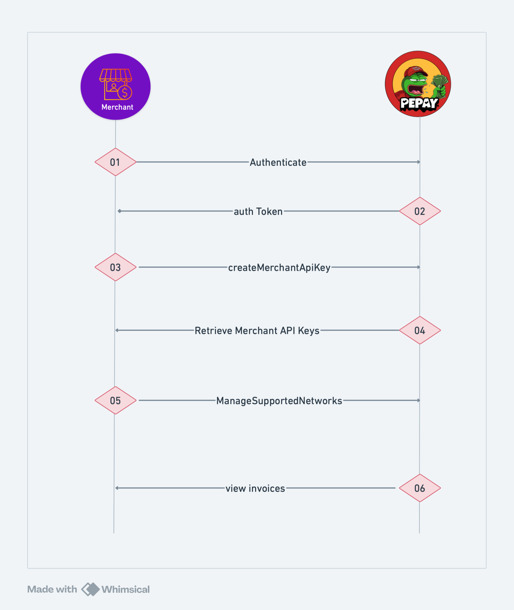

# Product Workflow

## Merchant Workflow&#x20;

<figure><figcaption></figcaption></figure>

***

## Agent Workflow

<figure><figcaption></figcaption></figure>

### Notes

* **Security**: All transactions and updates are secured via authenticated channels.
* **Transparency**: Customers can view invoices and payment statuses in real-time.
* **Automation**: AI agents handle all interactions to minimize manual intervention.
